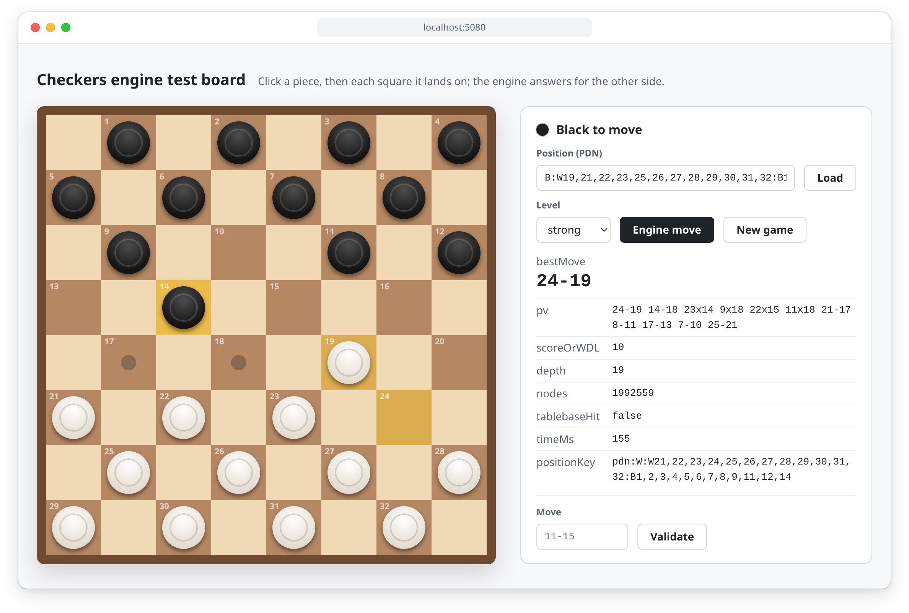
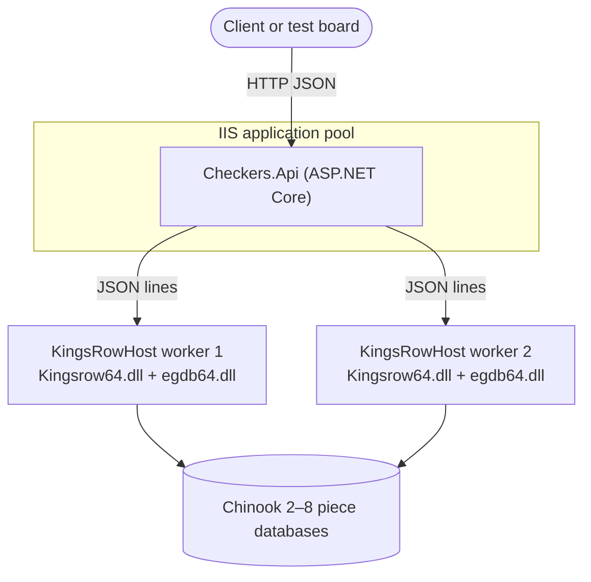
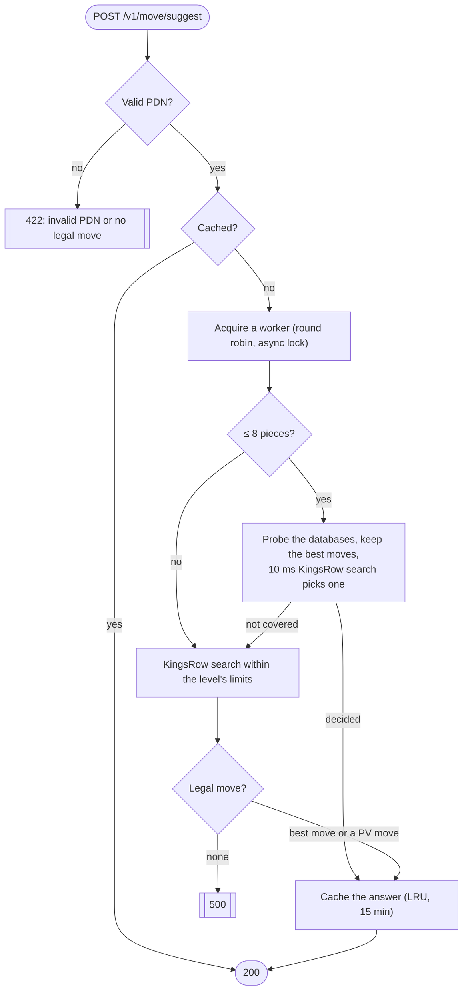
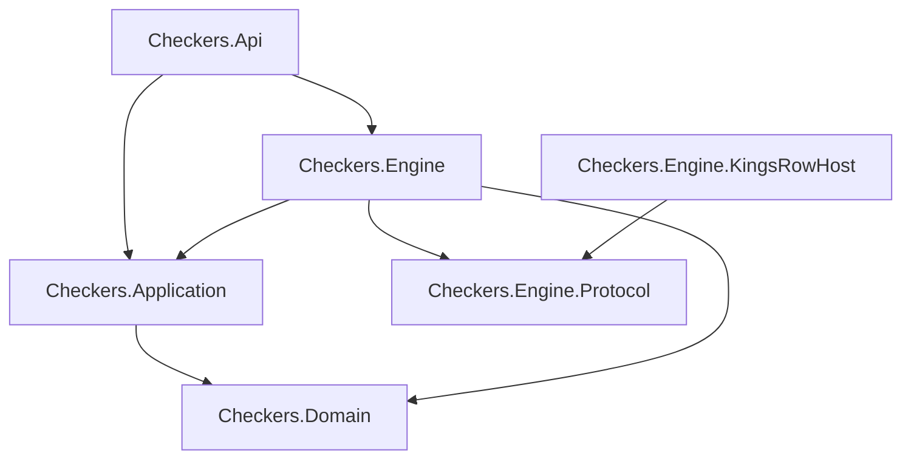

<div align="center">

# Checkers Engine API

**A REST Web API that finds the best move in an 8×8 checkers position.**<br>
Engine: KingsRow · Endgame databases: Chinook, 2–8 pieces · Hosting: ASP.NET Core on IIS




<sub>The built-in test board asking the engine for a move on the specification's sample position.</sub>

</div>

---

## Contents

- [Features](#features)
- [Acceptance criteria](#acceptance-criteria)
- [Quick start](#quick-start)
- [API](#api)
- [How it works](#how-it-works)
- [Configuration](#configuration)
- [Testing](#testing)
- [Deploying to IIS](#deploying-to-iis)
- [Design decisions](#design-decisions)
- [Known limitations](#known-limitations)
- [Credits](#credits)

## Features

- **Best move with analysis**: `bestMove`, principal variation, score or win/draw/loss value, depth and node count.
- **Endgame databases**: positions with 8 pieces or fewer are answered from the Chinook databases in milliseconds.
- **Strength levels**: `weak`, `medium` and `strong`, each optionally narrowed by per-request limits.
- **Long-lived engine workers**: two warm KingsRow processes, round-robin routing and one async lock per worker.
  No process is started per request.
- **Time limits**: the soft limit is enforced inside the engine; the hard limit is a deadline that ends in `504`.
- **Caching and logging**: an LRU cache for 15 minutes, keyed by canonical PDN, and one JSON log line per request.
- **Platforms**: Windows Server and IIS in production; Linux with Wine for development.

## Acceptance criteria

| Criterion from the specification | Status | Measured |
|---|:---:|---|
| Health check returns ok on startup | ✅ | `{"ok":true,"workers":2}` once both workers are warmed up |
| Tablebase position (≤ 8 pieces) in under 50 ms with `tablebaseHit: true` | ✅ warm | 8–20 ms across 9 positions with 3–8 pieces; the first request after startup took 30–57 ms |
| Midgame position, level `strong`, legal move in under 600 ms | ✅ | ≈ 100 ms on the specification's sample position, depth 19 |
| Invalid PDN gets `422` | ✅ | `422 Unprocessable PDN` with the reason, e.g. `Square 33 is outside 1-32.` |
| Timeouts return `504` | ✅ | `hardTimeMs: 30` on a quiet position gives `504`; workers stay healthy |

> [!NOTE]
> Measured on the development machine: Linux, KingsRow under Wine, Debug build, server-side `timeMs`.
> The service has not been measured on Windows Server/IIS yet.

## Quick start

### Prerequisites

| Requirement | Where to get it |
|---|---|
| .NET 10 SDK | https://dotnet.microsoft.com/download |
| KingsRow English 1.20 x64 | `KingsrowSetup64.1.20.exe` from [edgilbert.org](https://edgilbert.org/EnglishCheckers/KingsRowEnglish.htm). Install to a short path such as `C:\kingsrow` |
| Chinook 2–8 piece databases | `DB6.zip`, `DB7.0`–`DB7.4.zip` and `DB8.00`–`DB8.44.zip` from the [Chinook site](https://webdocs.cs.ualberta.ca/~chinook/databases/), unpacked into one folder (2.7 GB download, 5.6 GB unpacked) |

KingsRow and the databases are not part of this repository. The service also runs without the databases; then
every request uses an engine search.

### Windows

```powershell
$env:Engine__Path = "C:\kingsrow"
$env:Engine__Databases = "D:\tb\chinook"
dotnet run --project src/Checkers.Api
```

### Linux (Wine)

```bash
# 1. Install KingsRow into a dedicated Wine prefix
export WINEPREFIX=$PWD/.engine-cache/wineprefix
wine KingsrowSetup64.1.20.exe /VERYSILENT /SUPPRESSMSGBOXES '/DIR=C:\kingsrow'

# 2. Unpack the Chinook databases into .engine-cache/chinook-db (Wine maps Z: to /), then run
export Engine__Launcher=wine
export Engine__Databases="Z:$(pwd | tr / '\\')\\.engine-cache\\chinook-db"
dotnet run --project src/Checkers.Api
```

The service listens on http://localhost:5080. Open it in a browser for the test board, or call the API:

```bash
curl -s http://localhost:5080/v1/move/suggest -H 'Content-Type: application/json' -d '{
  "gameId": "checkers-8x8",
  "state": { "notation": "PDN", "position": "B:W18,19,22,25,27,28,30,32:B1,5,6,7,10,12,14,16" },
  "level": "strong"
}'
```

## API

### `POST /v1/move/suggest`

```json
{
  "gameId": "checkers-8x8",
  "state": { "notation": "PDN", "position": "B:W18,19,22,25,27,28,30,32:B1,5,6,7,10,12,14,16" },
  "level": "strong",
  "limits": { "maxDepth": 18, "softTimeMs": 500, "hardTimeMs": 1200 }
}
```

```json
{
  "engine": "chinook",
  "bestMove": "14x23",
  "pv": ["14x23", "27x18", "16x23", "25-21", "12-16", "28-24", "16-19", "24x15", "10x19", "22-17", "19-24"],
  "scoreOrWDL": 148,
  "depth": 19,
  "nodes": 787603,
  "positionKey": "pdn:B:W18,19,22,25,27,28,30,32:B1,5,6,7,10,12,14,16",
  "info": { "tablebaseHit": false, "timeMs": 103 }
}
```

<details>
<summary><b>Request fields</b></summary>

| Field | Required | Description |
|---|:---:|---|
| `gameId` | yes | Must be `checkers-8x8` |
| `state.notation` | yes | Must be `PDN` |
| `state.position` | yes | PDN FEN position: side to move, then the white and black pieces, e.g. `B:W18,19,K22:B1-3,5`. `K` marks a king; ranges are allowed |
| `level` | no | `weak`, `medium` or `strong` |
| `limits.maxDepth` | no | Upper bound on the search depth (best effort, see [design decisions](#design-decisions)) |
| `limits.softTimeMs` | no | Upper bound on the search time |
| `limits.hardTimeMs` | no | Deadline for the whole request; defaults to `Limits:DefaultHardTimeMs` |

</details>

<details>
<summary><b>Response fields</b></summary>

| Field | Description |
|---|---|
| `engine` | The configured `Engine:Type` |
| `bestMove` | The move in PDN notation; captures show the full path, e.g. `6x15x24` |
| `pv` | Principal variation, legal from the given position |
| `scoreOrWDL` | From the side to move's point of view: the KingsRow score (about 100 per man; ±2000 or more is a known win or loss), or `1` / `0` / `-1` for win / draw / loss when the answer came from the databases |
| `depth`, `nodes` | Search depth and node count |
| `positionKey` | `pdn:` followed by the canonical position |
| `info.tablebaseHit` | `true` when the endgame databases decided the move |
| `info.timeMs` | Server-side processing time |

</details>

**Strength levels.** Request `limits` can only lower these values.

| Level | Move time | Depth cap | Databases (≤ 8 pieces) |
|---|---|---|:---:|
| `weak` | 100 ms | 8 | ✅ |
| `medium` | 250 ms | 12 | ✅ |
| `strong` | 500 ms | 18 | ✅ |
| none | `Limits:DefaultSoftTimeMs` | — | ✅ |

**Status codes.** Errors use RFC 7807 problem details (`application/problem+json`).

| Code | When |
|---|---|
| `200` | A move was found |
| `400` | Malformed request: a missing field, a wrong `gameId` or `notation`, an unknown `level`, or a non-positive limit |
| `422` | Invalid PDN, or the side to move has no legal move |
| `500` | The engine failed, or none of its suggested moves is legal |
| `504` | `hardTimeMs` elapsed |

### `POST /v1/move/validate`

```json
{ "position": "B:W18,19,22,25,27,28,30,32:B1,5,6,7,10,12,14,16", "move": "14x23" }
```

Returns `{ "legal": true }` or `{ "legal": false }`. A capture can be written short (`6x24`) or with its full path
(`6x15x24`). A malformed position or move gets `422`.

### `GET /healthz`

Returns `{ "ok": true, "workers": 2 }`. `ok` is `false` while any configured worker is not ready, and `workers` is
the number of ready workers. The status code is always `200`.

### `GET /`

The test board. It draws the position the API returns, highlights the suggested move and validates a typed move.
It calls only the two endpoints above and contains no checkers rules.

## How it works

### Runtime

KingsRow is a native x64 Windows DLL with process-global state, so every worker is a separate, long-lived host
process. The API starts `Engine:Workers` hosts at application start, warms them up, and talks to each one in JSON
lines over stdin/stdout (`setPosition`, `search`, `probe`, `stop`). A host is restarted only when it fails or does
not stop after a timeout.



### Request flow



`softTimeMs` becomes KingsRow's exact move time inside the host. `hardTimeMs` is a `CancellationToken` in the
controller that covers both waiting for a worker and the search. When it expires, the response is `504` and the
search is stopped through KingsRow's `playnow` flag. If the worker is not idle within 250 ms, it is restarted.

### Projects



| Project | Responsibility |
|---|---|
| `Checkers.Domain` | Checkers rules: squares, pieces, positions, PDN FEN, move notation and legal move generation. No dependencies |
| `Checkers.Application` | Use cases (suggest, validate, health), strength levels and the LRU cache. Owns the ports the engine implements |
| `Checkers.Engine.Protocol` | JSON-lines messages shared by the API and the worker host |
| `Checkers.Engine` | Worker pool and host processes. Implements the Application ports |
| `Checkers.Engine.KingsRowHost` | win-x64 executable that loads `Kingsrow64.dll` and `egdb64.dll` through P/Invoke |
| `Checkers.Api` | Controllers, composition root, `web.config` and the test board |

Dependencies point inward. The controllers use only the Application; `Program.cs` is the only API code that
references the Engine project. Checkers rules exist only in the Domain.

## Configuration

`src/Checkers.Api/appsettings.json`:

```json
{
  "Engine": {
    "Type": "chinook",
    "Path": "C:\\kingsrow",
    "Workers": 2,
    "Databases": "D:\\tb\\chinook",
    "HostPath": "KingsRowHost/Checkers.Engine.KingsRowHost.exe",
    "Launcher": ""
  },
  "Cache": { "Capacity": 20000, "TtlMinutes": 15 },
  "Limits": { "DefaultSoftTimeMs": 300, "DefaultHardTimeMs": 1200 }
}
```

| Key | Meaning |
|---|---|
| `Engine:Type` | Engine name returned in every response |
| `Engine:Path` | KingsRow install directory (Windows path) containing `egdb64.dll` and `engines\Kingsrow64.dll` |
| `Engine:Workers` | Number of worker processes, 1–64 |
| `Engine:Databases` | Chinook database directory (Windows path of at most 200 characters, because `egdb64.dll` overruns a buffer on longer paths) |
| `Engine:HostPath` | Worker host executable, relative to the application directory. Build and publish put it in `KingsRowHost/` |
| `Engine:Launcher` | Program that starts the host: `wine` on Linux, empty on Windows |
| `Cache:Capacity`, `Cache:TtlMinutes` | LRU size and absolute time to live |
| `Limits:DefaultSoftTimeMs` | Search time when the request has no level |
| `Limits:DefaultHardTimeMs` | Deadline when the request has no `hardTimeMs` |

All options are validated at startup. Any key can be overridden by an environment variable, e.g. `Engine__Databases`.

## Testing

```bash
dotnet build CheckersEngineApi.slnx
dotnet test --solution CheckersEngineApi.slnx
```

| Test project | Covers |
|---|---|
| `Checkers.Domain.Tests` | PDN parsing and validation, canonical form, move generation (mandatory captures, multi-jumps, crowning), move notation |
| `Checkers.Application.Tests` | The suggest flow with a fake engine, the database path, levels and limits, cache expiry and eviction, move validation |
| `Checkers.Engine.Tests` | The worker pool (round robin, locks, restarts, timeouts), the protocol, the host's board and status-line conversions |
| `Checkers.Api.Tests` | The HTTP contract: JSON shapes, `400` / `422` / `504`, health, validation, the request log and the test board |

224 tests: 222 run everywhere, and 2 end-to-end tests run the real KingsRow host when `CHECKERS_KINGSROW_HOST`
(host executable), `CHECKERS_KINGSROW_PATH` and `CHECKERS_KINGSROW_DATABASES` (Windows paths) are set. Off Windows
these two run the host through Wine, in the prefix given by `WINEPREFIX`. `global.json` selects the
Microsoft.Testing.Platform runner that xUnit v3 needs for `dotnet test` on .NET 10.

## Deploying to IIS

1. Install the **ASP.NET Core 10 Hosting Bundle**.
2. Install KingsRow (e.g. `C:\kingsrow`) and unpack the databases (e.g. `D:\tb\chinook`).
3. Publish: `dotnet publish src/Checkers.Api -c Release -o <site folder>`. The output contains `web.config`
   (in-process hosting) and the self-contained `KingsRowHost\Checkers.Engine.KingsRowHost.exe`.
4. Set `Engine:Path` and `Engine:Databases` in `appsettings.json`, or as environment variables in `web.config`.
5. Configure the application pool:

   | Setting | Value | Why |
   |---|---|---|
   | .NET CLR version | No Managed Code | ASP.NET Core runs in-process through the ASP.NET Core Module |
   | Start Mode | `AlwaysRunning` | Workers start and warm up with the pool, not on the first request |
   | Preload Enabled (site) | `true` | Requires the IIS Application Initialization feature |
   | Idle Time-out | `0` | Keeps the pool and its warm workers alive |
   | Disable Overlapped Recycle | `true` | Two generations of workers never run at the same time |
   | Load User Profile | `true` | KingsRow keeps its settings in `HKCU` and writes a log under Documents |

6. Grant the pool identity (`IIS AppPool\<pool name>`) **Read & Execute** on the site, KingsRow and database
   folders, and **Modify** on the site's `logs` folder.
7. Request log: the JSON console lines go to `logs\stdout_<timestamp>_<pid>.log` (`stdoutLogEnabled="true"` in
   `web.config`). The module starts a new file per process start and never deletes old ones, so clean them up
   during normal maintenance.
8. Check `GET /healthz`, which should return `{ "ok": true, "workers": 2 }`.

## Design decisions

The specification leaves some points open or contradicts itself. Each decision below picks the narrowest
interpretation that satisfies the specification.

<details>
<summary><b>Engine and databases</b></summary>

- **"Chinook" means KingsRow with the Chinook databases.** There is no standalone Chinook engine for Windows; the
  specification itself names KingsRow with the Chinook 2–8 piece databases as the practical path. `engine` returns
  `Engine:Type` (`chinook`).
- **`Engine:Path` is the KingsRow install directory**, not a `chinook.exe`. KingsRow is a DLL, so it runs inside
  this project's worker host (`Engine:HostPath`). `Engine:Launcher` exists only to run that host under Wine.
- **"Perfect move" from a win/draw/loss database.** The probe finds the moves that keep the best value. A 10 ms
  KingsRow search with the same databases picks one of them, and its choice is checked against that set; a WLD
  table has no distance to the win, so this keeps a won game progressing. If that short search fails, the first
  proven move is returned with depth and nodes 0.
- **The database step applies to every level**, as in step 2 of the specification's flow; "strong: probe
  tablebases first" restates it.
- **8 pieces or fewer, but not covered.** Chinook's 7- and 8-piece sets cover only 4 v 3 and 4 v 4, and a smaller set
  may be installed. Such positions, and positions whose capture sequences run too long, fall back to a normal
  engine search.
- **Pending captures** are played out (at most 8 plies) before probing, because the databases hold no valid value
  while either side has a capture.
- **`tablebaseHit` from the engine** is inferred from KingsRow's root result (its database draw list, or a
  database score in a position within the loaded piece count), because KingsRow has no explicit flag.
- **`nodes`** is derived from KingsRow's kN/s and the elapsed time, because KingsRow does not report a node count.

</details>

<details>
<summary><b>Search, levels and caching</b></summary>

- **`maxDepth` with a time-based engine.** KingsRow has no depth limit, so the host stops the search once the
  reported depth reaches the cap. This is best effort: KingsRow reports depth in steps of 2 and only from time to
  time. Time is the enforced budget, so "depth X to Y or movetime Z" becomes move time Z with depth cap Y.
- **Level versus limits.** The level defines the budget, and request limits are upper bounds on it. Without a
  level the budget is `Limits:DefaultSoftTimeMs` with no depth cap. When `softTimeMs` ≥ `hardTimeMs` the result is
  a `504`.
- **`strong` uses 500 ms**, the low end of the specification's 500–600 ms range, so the total stays under the
  600 ms acceptance limit.
- **No randomness.** The opening book (random by default) is off, and each worker searches with one thread, at
  every level. A time-based search can still vary between runs; the cache keeps answers stable for its TTL.
- **Cache key** = canonical PDN + effective search limits (move time and depth cap). `hardTimeMs` only decides
  whether an answer arrives, so it is not part of the key. Only successful suggestions are cached, and the TTL is
  absolute.

</details>

<details>
<summary><b>API contract</b></summary>

- **The sample response in the specification is not a valid answer.** `22-18x11-7` is not PDN, it is a White move
  in a Black-to-move position, and the PV does not follow from it. Only its shape is kept; `bestMove` and `pv` are
  real legal moves, and captures show their full path (`6x15x24`).
- **PV** is the legal prefix of the engine's PV replayed from the position. If it does not start with the chosen
  move, the PV is `[bestMove]`.
- **"Try the next PV move"**: the candidates are the engine's best move followed by its PV moves, and the first
  one that is legal in the requested position is played. If none is, the response is `500`.
- **PDN input is a PDN FEN position**: either colour may come first, ranges and `K` kings are allowed, letters are
  upper case. Normalization means canonical ordering. Validation checks squares 1–32, duplicates, at most 12
  pieces per side and no man on its own crowning row.
- **A position with no legal move** cannot get a suggestion, so it gets `422`.
- **`400` versus `422`.** Request-shape errors use ASP.NET Core's standard `400` validation response; `422` is
  reserved for PDN content, as the specification states.
- **Timeouts.** `hardTimeMs` covers waiting for a worker and the search. On expiry nothing is cached.
- **Health.** `ok` means every configured worker is ready, and `workers` is the number of ready ones. The status
  is always `200`, because the specification defines only the body. A worker that fails to start fails application
  start.
- **JSON log per request.** There is one line per suggest request, with `requestId` (ASP.NET Core's
  `TraceIdentifier`), `timeMs`, `depth`, `nodes` and `tablebaseHit`; the last three are `null` when the request
  ended without a suggestion. Requests rejected by model validation (`400`), `validate` and `healthz` are not
  logged.

</details>

<details>
<summary><b>Hosting</b></summary>

- **IIS** uses in-process hosting with the settings from [Deploying to IIS](#deploying-to-iis). The request log is
  kept through the ASP.NET Core Module's stdout log, the built-in way to keep console output under IIS.
- **The test board** draws from the canonical `positionKey` the API returns and contains no checkers rules.

</details>

## Known limitations

- A king capture that ends on its own start square cannot be read back from KingsRow: it reports such a move as
  `xxxx` and the board does not change. That rare case returns `500`.
- The depth cap is approximate, and on a repeated position the warm hash table lets KingsRow report deep results
  within a few milliseconds.
- `nodes` of the very first search in a worker includes KingsRow's database initialization; the warm-up absorbs it.
- The test board shows what the API returns; it does not play games.
- Under Wine the database path must stay short (MAX_PATH): use a short directory or an 8.3 path.

## Credits

- [KingsRow](https://edgilbert.org/EnglishCheckers/KingsRowEnglish.htm), the checkers engine by Ed Gilbert.
- [Chinook endgame databases](https://webdocs.cs.ualberta.ca/~chinook/databases/) by Jonathan Schaeffer and the
  Chinook team, University of Alberta.
- The engine interface follows [CheckerBoard](https://github.com/eygilbert/CheckerBoard), originally by Martin Fierz.

KingsRow and the databases are free downloads from their authors and are not redistributed here.
