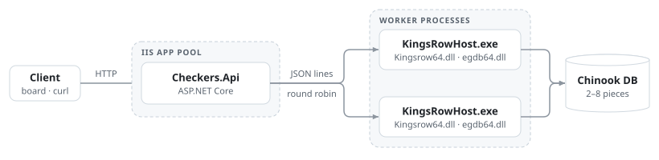
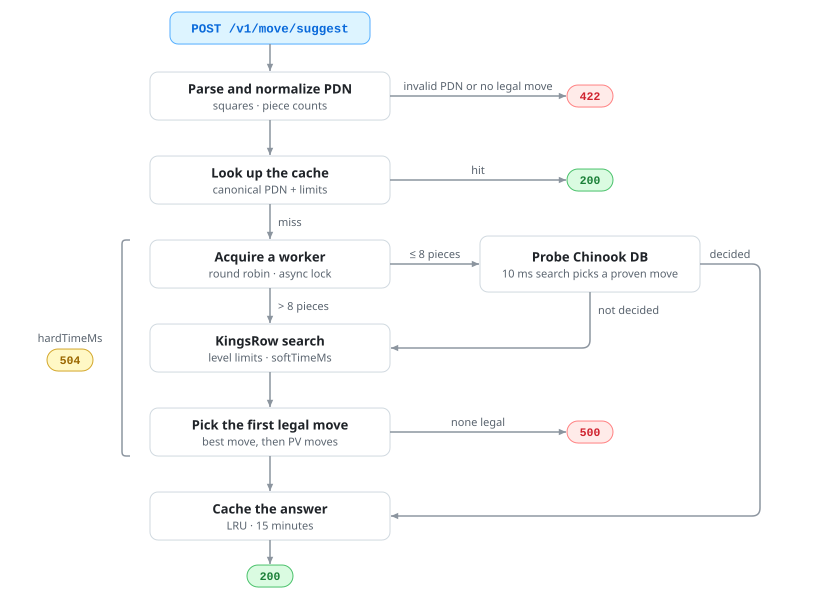
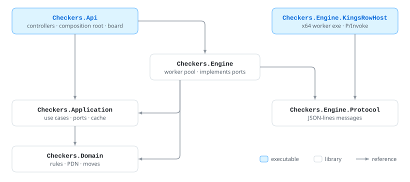

<div align="center">

# Checkers Engine API

**REST Web API that returns the best move for an 8×8 checkers position.**


<sub>Test board (<code>GET /</code>) on the specification's sample position</sub>

</div>

## Acceptance criteria

| Requirement | Result |
|---|---|
| Health check returns ok on startup | ✅ `{"ok":true,"workers":2}` once both workers are warm |
| ≤ 8 pieces in under 50 ms with `tablebaseHit: true` | ✅ 8–20 ms warm (9 positions, 3–8 pieces); 30–57 ms for the first request after startup |
| Midgame, `strong`, legal move in under 600 ms | ✅ ≈ 100 ms on the sample position, depth 19 |
| Invalid PDN → `422` | ✅ Problem details with the reason, e.g. `Square 33 is outside 1-32.` |
| Timeout → `504` | ✅ `hardTimeMs: 30` → `504`; the workers stay healthy |

> [!NOTE]
> Measured on Linux with KingsRow under Wine (Debug build, server-side `timeMs`), not yet on Windows Server/IIS.

## Quick start

**Requirements**

- [.NET 10 SDK](https://dotnet.microsoft.com/download)
- [KingsRow English 1.20 x64](https://edgilbert.org/EnglishCheckers/KingsRowEnglish.htm) (`KingsrowSetup64.1.20.exe`), installed to a short path such as `C:\kingsrow`
- Optional: [Chinook databases](https://webdocs.cs.ualberta.ca/~chinook/databases/) `DB6.zip`, `DB7.0`–`DB7.4.zip`, `DB8.00`–`DB8.44.zip`,
  unpacked into one folder (2.7 GB download, 5.6 GB unpacked). Without them every request uses an engine search.

KingsRow and the databases are free downloads from their authors and are not part of this repository.

**Windows**

```powershell
$env:Engine__Path = "C:\kingsrow"
$env:Engine__Databases = "D:\tb\chinook"
dotnet run --project src/Checkers.Api
```

**Linux (Wine)**

```bash
export WINEPREFIX=$PWD/.engine-cache/wineprefix
wine KingsrowSetup64.1.20.exe /VERYSILENT /SUPPRESSMSGBOXES '/DIR=C:\kingsrow'

# Databases unpacked into .engine-cache/chinook-db; Wine maps Z: to /
export Engine__Launcher=wine
export Engine__Databases="Z:$(pwd | tr / '\\')\\.engine-cache\\chinook-db"
dotnet run --project src/Checkers.Api
```

Open http://localhost:5080 for the test board, or call the API:

```bash
curl -s http://localhost:5080/v1/move/suggest -H 'Content-Type: application/json' -d '{
  "gameId": "checkers-8x8",
  "state": { "notation": "PDN", "position": "B:W18,19,22,25,27,28,30,32:B1,5,6,7,10,12,14,16" },
  "level": "strong"
}'
```

## API

### `POST /v1/move/suggest`

```json
{
  "gameId": "checkers-8x8",
  "state": { "notation": "PDN", "position": "B:W18,19,22,25,27,28,30,32:B1,5,6,7,10,12,14,16" },
  "level": "strong",
  "limits": { "maxDepth": 18, "softTimeMs": 500, "hardTimeMs": 1200 }
}
```

```json
{
  "engine": "chinook",
  "bestMove": "14x23",
  "pv": ["14x23", "27x18", "16x23", "25-21", "12-16", "28-24",
         "16-19", "24x15", "10x19", "22-17", "19-24"],
  "scoreOrWDL": 148,
  "depth": 19,
  "nodes": 787603,
  "positionKey": "pdn:B:W18,19,22,25,27,28,30,32:B1,5,6,7,10,12,14,16",
  "info": { "tablebaseHit": false, "timeMs": 103 }
}
```

<details>
<summary><b>Request fields</b></summary>

| Field | Required | Value |
|---|:---:|---|
| `gameId` | ✓ | `checkers-8x8` |
| `state.notation` | ✓ | `PDN` |
| `state.position` | ✓ | PDN FEN: side to move, white pieces, black pieces, e.g. `B:W18,19,K22:B1-3,5` (`K` = king, ranges allowed) |
| `level` | | `weak`, `medium` or `strong` |
| `limits.maxDepth` | | Depth cap, best effort |
| `limits.softTimeMs` | | Search time cap |
| `limits.hardTimeMs` | | Deadline for the whole request; default `Limits:DefaultHardTimeMs` |

</details>

<details>
<summary><b>Response fields</b></summary>

| Field | Value |
|---|---|
| `engine` | `Engine:Type` |
| `bestMove` | PDN move; captures show the full path, e.g. `6x15x24` |
| `pv` | Principal variation, legal from the given position |
| `scoreOrWDL` | For the side to move: KingsRow score (≈ 100 per man, ±2000 and beyond = known win or loss), or `1` / `0` / `-1` from the databases |
| `depth`, `nodes` | Search depth and node count |
| `positionKey` | `pdn:` + canonical position |
| `info.tablebaseHit` | `true` when the databases decided the move |
| `info.timeMs` | Server-side time |

</details>

| `level` | Move time | Depth cap |
|---|---|---|
| `weak` | 100 ms | 8 |
| `medium` | 250 ms | 12 |
| `strong` | 500 ms | 18 |
| none | `Limits:DefaultSoftTimeMs` | — |

Request `limits` can only lower these values, and `softTimeMs` ≥ `hardTimeMs` ends in `504`. With 8 pieces or fewer,
every level asks the databases first.

| Status | When |
|---|---|
| `200` | A move was found |
| `400` | Malformed request: missing field, wrong `gameId` or `notation`, unknown `level`, non-positive limit |
| `422` | Invalid PDN, or the side to move has no legal move |
| `500` | The engine failed, or none of its moves is legal |
| `504` | `hardTimeMs` elapsed |

Errors are RFC 7807 problem details.

### `POST /v1/move/validate`

```json
{ "position": "B:W18,19,22,25,27,28,30,32:B1,5,6,7,10,12,14,16", "move": "14x23" }
```

Returns `{ "legal": true }` or `{ "legal": false }`. Captures can be short (`6x24`) or full (`6x15x24`).
A malformed position or move gets `422`.

### `GET /healthz`

Returns `{ "ok": true, "workers": 2 }`: `ok` is `false` until every configured worker is ready, and `workers` counts the
ready ones. Always `200`.

### `GET /`

The test board: draws the returned position, highlights the suggested move and validates a typed move. It calls only
the endpoints above and has no checkers rules of its own.

## How it works

### Runtime

<p align="center">
  <picture>
    <source media="(prefers-color-scheme: dark)" srcset="docs/runtime-dark.svg">
    
  </picture>
</p>

KingsRow is a native x64 DLL with process-global state, so each worker is a separate long-lived process.
`Engine:Workers` hosts start and warm up with the application and speak JSON lines over stdin/stdout
(`setPosition`, `search`, `probe`, `stop`). A host that fails to start fails application start; a running host is
restarted only when it fails or does not stop in time.

### Request flow

<p align="center">
  <picture>
    <source media="(prefers-color-scheme: dark)" srcset="docs/request-flow-dark.svg">
    
  </picture>
</p>

`softTimeMs` is KingsRow's exact move time. `hardTimeMs` is a `CancellationToken` that covers the wait for a worker
and the search; on expiry KingsRow is stopped through its `playnow` flag, and a worker that is not idle within 250 ms
is restarted.

### Projects

<p align="center">
  <picture>
    <source media="(prefers-color-scheme: dark)" srcset="docs/projects-dark.svg">
    
  </picture>
</p>

References point inward: the controllers use only the Application, `Program.cs` alone references the Engine, and
checkers rules live only in the Domain.

## Configuration

```jsonc
{
  "Engine": {
    "Type": "chinook",              // returned as "engine"
    "Path": "C:\\kingsrow",         // KingsRow install folder
    "Workers": 2,                   // worker processes, 1–64
    "Databases": "D:\\tb\\chinook", // Chinook databases, at most 200 characters
    "HostPath": "KingsRowHost/Checkers.Engine.KingsRowHost.exe",
    "Launcher": ""                  // "wine" on Linux
  },
  "Cache": { "Capacity": 20000, "TtlMinutes": 15 },
  "Limits": { "DefaultSoftTimeMs": 300, "DefaultHardTimeMs": 1200 }
}
```

These are the `appsettings.json` defaults; `HostPath` is relative to the application folder. Options are validated
at startup, and environment variables override them, e.g. `Engine__Databases`.

## Testing

```bash
dotnet test --solution CheckersEngineApi.slnx
```

| Project | Covers |
|---|---|
| `Checkers.Domain.Tests` | PDN parsing and validation, canonical form, move generation (mandatory captures, multi-jumps, crowning), notation |
| `Checkers.Application.Tests` | Suggest flow with a fake engine, database path, levels and limits, cache expiry and eviction, validation |
| `Checkers.Engine.Tests` | Worker pool (round robin, locks, restarts, timeouts), protocol, host board and status-line conversions |
| `Checkers.Api.Tests` | HTTP contract: JSON shapes, `400` / `422` / `504`, health, request log, test board |

Two end-to-end tests run the real KingsRow host when `CHECKERS_KINGSROW_HOST`, `CHECKERS_KINGSROW_PATH` and
`CHECKERS_KINGSROW_DATABASES` are set (off Windows through Wine, in `WINEPREFIX`); otherwise they are skipped.
`global.json` selects Microsoft.Testing.Platform, which xUnit v3 needs for `dotnet test` on .NET 10.

## Deploying to IIS

1. Install the **ASP.NET Core 10 Hosting Bundle**, KingsRow and the databases.
2. Publish: `dotnet publish src/Checkers.Api -c Release -o <site folder>`. The output contains `web.config`
   (in-process hosting) and the self-contained `KingsRowHost\Checkers.Engine.KingsRowHost.exe`.
3. Set `Engine:Path` and `Engine:Databases` in `appsettings.json` or as environment variables in `web.config`.
4. Configure the application pool:

   | Setting | Value | Why |
   |---|---|---|
   | .NET CLR version | No Managed Code | ASP.NET Core runs in-process |
   | Start Mode | `AlwaysRunning` | Workers warm up with the pool, not on the first request |
   | Preload Enabled (site) | `true` | Needs the IIS Application Initialization feature |
   | Idle Time-out | `0` | Keeps the warm workers alive |
   | Disable Overlapped Recycle | `true` | Never two generations of workers at once |
   | Load User Profile | `true` | KingsRow keeps settings in `HKCU` and writes a log under Documents |

5. Grant `IIS AppPool\<pool>` **Read & Execute** on the site, KingsRow and database folders, and **Modify** on `logs`.
6. The JSON request log goes to `logs\stdout_*.log` (`stdoutLogEnabled="true"`). Old files are never deleted
   automatically.
7. Check that `GET /healthz` returns `{ "ok": true, "workers": 2 }`.

## Design decisions

- **"Chinook" = KingsRow with the Chinook databases**, the practical Windows path the specification names. `engine`
  returns `Engine:Type`, and `Engine:Path` is the KingsRow folder: KingsRow is a DLL hosted by this project's worker.
- **Perfect move from win/draw/loss tables.** The probe keeps the moves with the best value, and a 10 ms KingsRow
  search picks one of them, so a won game keeps progressing (the tables hold no distance to the win).
- **Undecided database positions fall back to a search**: piece counts outside the installed sets (Chinook's 7 and
  8-piece sets are 4 v 3 and 4 v 4 only) and capture sequences longer than 8 plies. Pending captures are played out
  before probing.
- **Inferred engine statistics**: `tablebaseHit` from KingsRow's root result and `nodes` from kN/s × time, because
  KingsRow reports neither.
- **Time is the enforced budget.** "Depth X to Y or movetime Z" becomes move time Z with depth cap Y; KingsRow has no
  depth limit, so the cap stops the search once the reported depth reaches it.
- **`strong` uses 500 ms**, the low end of 500–600 ms, to stay under the 600 ms acceptance limit.
- **No randomness**: opening book off, one search thread per worker. The cache keeps answers stable for its TTL.
- **Cache key** = canonical PDN + effective limits. Only successful answers are cached.
- **The specification's sample response is not a valid answer** (`22-18x11-7` is a White move in a Black-to-move
  position). Only its shape is kept.
- **"Try the next PV move"**: the first legal move among the best move and the PV is played, otherwise `500`. `pv` is
  the legal prefix of the engine's line.
- **PDN validation**: squares 1–32, no duplicates, at most 12 pieces per side, no man on its crowning row.
  `400` covers the request shape; `422` is reserved for PDN content.
- **Request log**: one JSON line per suggest request that passes model validation, with `requestId`, `timeMs`,
  `depth`, `nodes` and `tablebaseHit`; the last three are `null` when no move was returned.

## Known limitations

- KingsRow reports a king capture that ends on its own start square as `xxxx` with an unchanged board, so that rare
  case returns `500`.
- The depth cap is approximate, and on a repeated position the warm hash table returns deep results in milliseconds.
- `nodes` of a worker's first search includes KingsRow's database initialization; the warm-up absorbs it.
- `egdb64.dll` overruns a buffer on database paths longer than 200 characters, so startup rejects them. Under Wine
  the path must also be short (MAX_PATH): use a short folder or an 8.3 path.

## Credits

[KingsRow](https://edgilbert.org/EnglishCheckers/KingsRowEnglish.htm) by Ed Gilbert ·
[Chinook endgame databases](https://webdocs.cs.ualberta.ca/~chinook/databases/) by Jonathan Schaeffer and the Chinook
team, University of Alberta · engine interface after [CheckerBoard](https://github.com/eygilbert/CheckerBoard) by
Martin Fierz.
